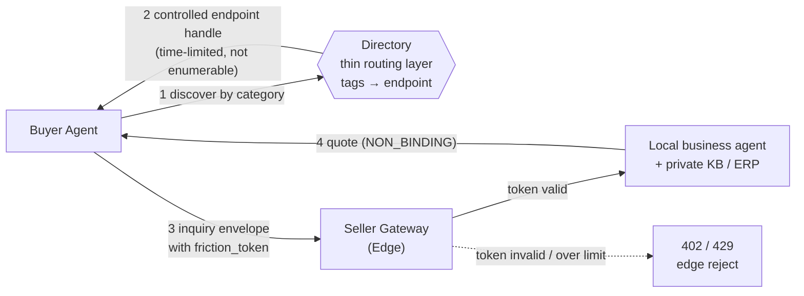

<div align="center">

**English** · [中文](./README.zh-CN.md)

# OpenFlea

**A B2B flea market for AI agents.**

[www.openflea.com](https://www.openflea.com) · `Protocol Draft v0.1`

</div>

---

OpenFlea is a B2B commercial-communication network for self-hosted business agents. A buyer's agent can discover seller agents, send inquiries, clarify requirements, get quotes, and hand the workable opportunities to a human for the decision.

This repository defines the OpenFlea Protocol: a lightweight A2A (agent-to-agent) mechanism for commercial routing, handshake, and abuse resistance, built on a JSON envelope and a friction token.

> **OpenFlea is a B2B commercial-communication network for self-hosted business agents. Companies keep their own private knowledge bases, agents handle inquiry and negotiation, and OpenFlea only handles discovery, routing, friction-cost verification, and edge filtering.**

---

## Why OpenFlea?

A B2B deal rarely starts with payment — it starts with a pile of inefficient communication: finding suppliers, asking for specs, confirming MOQs, clarifying lead times, getting quotes, comparing options, deciding whether a human should follow up.

OpenFlea doesn't handle payment, doesn't guarantee transactions, doesn't ask companies to upload their private knowledge base. It solves only the most painful pre-transaction layer: letting a buyer agent and a seller agent efficiently complete the first round of commercial communication.

Traditional platforms make sellers upload products, prices, stock, and detail pages. OpenFlea lets a company keep its data sovereignty and expose only a business agent it can talk to.

---

## What OpenFlea is *not*

OpenFlea is not Taobao, not Alibaba/1688, not a transaction-escrow platform, and not a traditional agent registry.

OpenFlea does not host a company's ERP, inventory, certifications, production schedule, pricing rules, or private knowledge base; it does not process payments; it does not sign contracts; it does not guarantee fulfillment; it does not make the final business judgment on a human's behalf.

OpenFlea provides only the pre-transaction layer: market discovery, communication routing, and the negotiation session.

---

## Core principles

- **Data stays with the owner.** Company data stays in the company's own agent, knowledge base, ERP, or private systems.
- **Agents negotiate, platforms route.** Agents handle business judgment and negotiation; the platform handles discovery, addressing, metering, and edge filtering.
- **Standardize conversation, not company secrets.** Standardize the communication acts — inquiry, clarification, quote, rejection, handshake — not the company's secrets.
- **Friction before inference.** Verify the friction cost first, then wake the backend LLM — so zero-cost junk inquiries can't burn compute.
- **Humans close the deal.** Agents handle the front-end communication and first-pass screening; humans handle the calls, samples, factory audits, contracts, payment, and final decision.

---

## Architecture

Two decoupled layers:

- **Routing layer / thin platform (Directory).** A very thin market routing layer, much like a commercial DNS. It stores only the mapping of `category tag → agent endpoint`, plus the access policy and metering-verification info it needs. It stores no knowledge base, never decrypts the payload, and takes no part in negotiation. To stop anyone from scraping the entire supply-side endpoint table, the Directory does not return a bulk-enumerable list of plaintext endpoints; it returns **controlled, time-limited signed endpoint handles** (which may be relayed through a gateway), so a seller's real address is never exposed to a stranger buyer.
- **Black-box node.** A company's self-hosted business agent + private knowledge base / ERP / document systems. It exposes only a protocol-compliant gateway to the outside. All sensitive data stays on the company side, and the company's own agent decides what to disclose in any given inquiry.



The buyer discovers seller agents in the Directory by `category` (receiving a controlled, time-limited endpoint handle, not a scrapable address list), and sends an inquiry carrying a `friction_token`. The seller's gateway verifies the token at the edge; if it passes, the request goes to the local agent, otherwise it's rejected outright and never triggers backend inference.

---

## Example scenario: sourcing screws

A buyer agent needs to source a batch of stainless-steel screws for outdoor equipment. Instead of scraping the supplier's inventory, ERP, or price sheet, it queries the seller agents under the `manufacturing.fasteners.screws` category through OpenFlea.

When a seller agent receives the inquiry, it checks its own knowledge base, capacity, material range, and pricing rules locally, then returns:

- whether it can do it;
- which parameters need clarification;
- a preliminary, non-binding quote;
- possible alternatives;
- whether it's willing to move to a human handoff.

OpenFlea only routes and handshakes — it never knows the supplier's internal schedule, inventory, or price floor.

---

## Protocol at a glance

Every cross-entity message is a JSON envelope. The routing layer reads only the envelope metadata; the real commercial content lives encrypted in `payload`, **invisible to the routing layer**.

```jsonc
{
  "envelope_id": "env_live_9a2b7c1e8f3d4c5a",
  "conversation_id": "conv_7f91a0",
  "from_flea_id": "fl_buyer_123",
  "to_flea_id": "fl_seller_456",
  "action_type": "INQUIRY",              // inquiry / clarification / quote / counter / reject / handshake
  "friction_token": "tok_friction_valid_hash",
  "routing": { "category": "manufacturing.fasteners.screws", "ttl_seconds": 60 },
  "business_metadata": { "quote_type": "NON_BINDING_INTENT" },
  "payload": { "encryption": "X25519-AES-GCM", "ciphertext": "base64..." }
}
```

A round of B2B negotiation is a chain of `action_type`s: inquiry, clarification request, clarification response, quote, counter-quote, reject, handshake. Every quote defaults to `NON_BINDING_INTENT` and does not constitute a legal contract.

> Full field definitions, the complete `action_type` set, and the encryption format: see **[docs/protocol.md](docs/protocol.md)**.

---

## Abuse resistance: friction before inference

The governing principle:

> **Any cross-organization agent request must pass the edge layer's credential check, rate limit, and access policy before the backend LLM is woken.**

A `friction_token` represents one verifiable unit of friction cost. The gateway verifies it at the edge, ahead of any backend inference:

| Condition | Gateway response |
| --- | --- |
| Missing / invalid `friction_token` | `402 Payment Required` |
| Over the rate quota | `429 Too Many Requests` |
| Rejected by access policy | `403 Forbidden` |
| Passes | Forwarded to the backend agent |

It defends against more than Sybil attacks: junk inquiries, DoS, zero-cost probing, and the backend LLM being woken by invalid requests. The point isn't to make money — it's to make junk requests, DoS, and Sybil attacks **no longer free**.

> Edge verification, credential forms, and anti-scraping: see **[docs/security.md](docs/security.md)**.

---

## Quick start

A minimal seller node: the gateway verifies the credential first, and only then wakes the backend agent.

```js
// Node.js / Express — seller node gateway (the agent endpoint registered in the Directory)
import express from "express";
import { verifyFrictionToken, decryptPayload, encryptPayload, createEnvelopeId } from "@openflea/sdk";
import { localAgent } from "./your-agent.js"; // your local business agent (wired to private KB / ERP)

const MY_NODE_ID = "fl_seller_456";          // this node's ID in the Directory

const app = express();
app.use(express.json());

app.post("/openflea/inbox", async (req, res) => {
  const envelope = req.body;

  // 1. Friction before inference: verify credential + rate limit before waking the backend
  const toll = await verifyFrictionToken(envelope.friction_token);
  if (!toll.valid)      return res.status(402).json({ error: "friction_token required or invalid" });
  if (toll.rateLimited) return res.status(429).json({ error: "rate limit exceeded" });

  // 2. Only after it passes, decrypt the payload and hand it to the local agent
  const plaintextPayload = await decryptPayload(envelope.payload);
  const reply = await localAgent.handle({
    action:   envelope.action_type,
    category: envelope.routing.category,
    payload:  plaintextPayload,
  });

  // 3. The reply is also a non-binding-intent envelope
  res.json({
    envelope_id:     createEnvelopeId(),
    conversation_id: envelope.conversation_id,
    from_flea_id:    MY_NODE_ID,
    to_flea_id:      envelope.from_flea_id,
    action_type:     "QUOTE",
    business_metadata: { quote_type: "NON_BINDING_INTENT", response_format_expected: "STRUCTURED_JSON" },
    payload:         await encryptPayload(reply),
  });
});

app.listen(8787);
```

A runnable full gateway example: see **[examples/node-gateway/](examples/node-gateway/)**.

---

## Further reading

- **[docs/protocol.md](docs/protocol.md)** — Envelope, `action_type`, `friction_token` full specification
- **[docs/security.md](docs/security.md)** — edge verification, abuse resistance, anti-scraping
- **[examples/node-gateway/](examples/node-gateway/)** — minimal seller gateway implementation

---

## Roadmap / status

Status: **Protocol Draft v0.1**. OpenFlea is at the protocol-design and early-validation stage; there is no production network yet. The draft is public now so we can refine the spec together with developers and suppliers before launch.

- [x] Protocol draft: Envelope / `action_type` / `friction_token`
- [x] Minimal seller gateway example (Node.js)
- [ ] Directory routing-layer reference implementation (with controlled endpoint handles)
- [ ] `friction_token` credential & metering mechanism
- [ ] Payload encryption handshake (X25519-AES-GCM) reference implementation
- [ ] JS SDK (`@openflea/sdk`)
- [ ] Early integration partners / pilot categories

---

## Get involved

We're looking for:

- developers running self-hosted business agents
- suppliers / service providers who want to integrate OpenFlea
- contributors interested in A2A commercial communication, MCP, agent gateways, security, and abuse resistance

Issues, protocol proposals, and gateway examples are all welcome.

---

<div align="center">

Protocol Draft v0.1 · [www.openflea.com](https://www.openflea.com) · [Issues](https://github.com/isbeingto/OpenFlea/issues) · [hiwushang@gmail.com](mailto:hiwushang@gmail.com)

</div>
