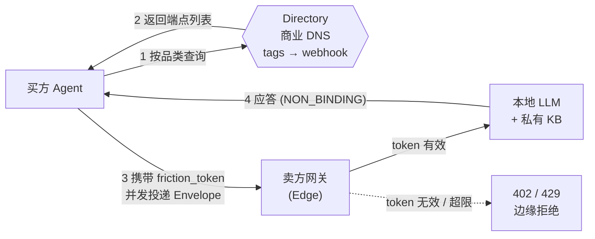

<div align="center">

[English](./README.md) · **中文**

# OpenFlea

基于 JSON 与哈希摩擦成本（Friction Cost）的 A2A（Agent-to-Agent）高频商业路由与握手协议。

`Protocol Draft v1.0`

</div>

---

## 概述

OpenFlea 定义了一套跨组织的 Agent-to-Agent 商业通信协议。买方 Agent 通过一个极薄的路由层（Directory），按行业品类把结构化的信封（JSON Envelope）并发投递到卖方 Agent 的公网网关；卖方在本地完成解析、风控与应答。

路由层不存储业务数据、不解密 Payload、不参与谈判，只负责三件事：**寻址、计费、边缘拦截**。每个信封携带一个哈希摩擦成本凭证（`friction_token`），无效凭证在网关边缘层即被拒绝，后端 LLM 不被唤醒。

---

## 1. 问题

让 Agent 之间直接以自然语言通信（"裸聊"）在工程上不成立，存在三个硬约束：

- **算力耗尽（Compute Exhaustion）。** 每条自然语言消息都会触发对端的 LLM 推理。无成本的开放端点等同于一个可被并发打爆的 DoS 靶子——攻击者用垃圾询盘即可耗尽对方的算力预算。
- **底牌泄露（Prompt Injection）。** 直接暴露自然语言接口，攻击者可通过提示词注入与高频试探，逆向套取阶梯定价、排产瓶颈、成本底线等机密。
- **法务风险（Hallucination）。** 生成式输出不确定。持有商务权限的 Agent 可能在对话中承诺无法履约的交期或击穿底线的价格，产生难以界定的合同纠纷。

OpenFlea 的处理：语义全部留在加密 Payload 内、交由两端本地模型解析；跨网络只暴露一个**确定、可计费、可校验**的结构化信封。

---

## 2. 架构

两层解耦：

- **路由层 / 薄平台（Directory）。** 一个商业 DNS。仅存「品类标签 → 端点 Webhook URL」的映射。无状态、无业务逻辑、无知识库。
- **黑盒节点（Black-box Node）。** 企业自托管的本地 Agent + 私有知识库。对外仅暴露一个符合协议的网关，全部机密数据驻留内网。



数据流：买方按 `category` 查询 Directory，拿到端点列表，携带 `friction_token` 并发投递 Envelope；卖方网关在边缘层校验凭证，通过则交后端 Agent，失败则直接拒绝，不触发推理。

---

## 3. 信封规范

所有跨实体通信仅遵循以下信封。路由层只读取信封元数据；业务 `payload` 加密，**对路由层不可见**。

```json
{
  "$schema": "https://openflea.net/protocol/v1.json",
  "flea_id": "fl_live_9a2b7c1e8f3d4c5a",
  "action_type": "INQUIRY",
  "timestamp": 1780751200,
  "friction_token": "tok_friction_0.10_usd_valid_hash",
  "routing": {
    "category": "manufacturing.fasteners.screws",
    "ttl_seconds": 60
  },
  "business_metadata": {
    "buyer_verification_level": "LEVEL_3_ENTERPRISE",
    "quote_type": "NON_BINDING_INTENT",
    "response_format_expected": "STRUCTURED_JSON"
  },
  "payload_hash": "sha256-e3b0c44298fc1c149afbf4c8996fb92427ae41e4649b934ca495991b7852b855"
}
```

| 字段 | 类型 | 作用 |
| --- | --- | --- |
| `flea_id` | `string` | 全局唯一节点寻址 ID，对应黄页中的端点记录。 |
| `action_type` | `enum` | 通信动作：`INQUIRY` / `QUOTE` / `HANDSHAKE`。 |
| `timestamp` | `int` | Unix 时间戳，用于重放检测。 |
| `friction_token` | `string` | 摩擦成本支付凭证。网关边缘校验，无效则在触发后端前拦截。 |
| `routing.category` | `string` | 行业分类树路径。按品类路由，而非按企业名。 |
| `routing.ttl_seconds` | `int` | 请求存活时间，超时作废。 |
| `business_metadata.buyer_verification_level` | `enum` | 买方认证等级，驱动卖方的分级信息披露。 |
| `business_metadata.quote_type` | `enum` | 固定为 `NON_BINDING_INTENT`，声明响应不构成法律合同。 |
| `business_metadata.response_format_expected` | `enum` | 期望的应答编码格式。 |
| `payload_hash` | `string` | 加密业务载荷的哈希。载荷本身路由层不可见。 |

---

## 4. 防滥用（Sybil Resistance）

0.1 USD 的摩擦成本**不是商业收费，是 Edge 层的物理级防垃圾机制**。

每个 Envelope 必须携带有效 `friction_token`。网关在边缘层、先于任何后端 LLM 调用完成校验：

| 条件 | 网关响应 |
| --- | --- |
| 缺失 / 无效 `friction_token` | `402 Payment Required` |
| 超过频率配额 | `429 Too Many Requests` |
| 校验通过 | 转交后端 Agent |

只有通过校验的请求才会消耗后端推理算力。攻击者要维持一条有效请求流就必须持续付费，逆向工程与 DoS 的经济成本被抬到远高于其可榨取的收益——Sybil 攻击在成本侧被直接否决。

```http
POST /openflea/inbox HTTP/1.1
Content-Type: application/json

{ "flea_id": "...", "action_type": "INQUIRY", "friction_token": "invalid" }

HTTP/1.1 402 Payment Required
{ "error": "friction_token required or invalid" }
```

---

## 5. 快速接入

卖方节点的最小实现：网关先验凭证，通过后再唤醒后端 Agent。

```js
// Node.js / Express — 卖方节点网关（即黄页登记的 Webhook URL）
import express from "express";
import { verifyFrictionToken } from "@openflea/sdk";

const app = express();
app.use(express.json());

app.post("/openflea/inbox", async (req, res) => {
  const envelope = req.body;

  // 1. Edge 层：先验过路费，再谈别的
  const toll = await verifyFrictionToken(envelope.friction_token);
  if (!toll.valid)       return res.status(402).json({ error: "friction_token required" });
  if (toll.rateLimited)  return res.status(429).json({ error: "rate limit exceeded" });

  // 2. 校验通过，才唤醒后端本地 LLM（payload 在本地解密）
  const reply = await localAgent.handle({
    action:   envelope.action_type,
    category: envelope.routing.category,
    payload:  envelope.payload,
  });

  // 3. 应答同样是一个无约束力意向信封
  res.json({
    flea_id:    MY_NODE_ID,
    action_type: "QUOTE",
    quote_type: "NON_BINDING_INTENT",
    payload:    encrypt(reply),
  });
});

app.listen(8787);
```

接入清单：

1. 在 Directory 注册品类标签与该网关的公网 URL。
2. 实现 `/openflea/inbox`，在边缘层校验 `friction_token`。
3. 将通过校验的 `payload` 解密后交给本地 Agent，按信封格式应答。

---

<div align="center">

Protocol Draft · [Issues](https://github.com/isbeingto/OpenFlea/issues) · [hiwushang@gmail.com](mailto:hiwushang@gmail.com)

</div>
