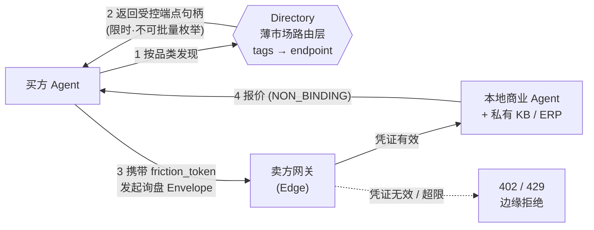

<div align="center">

[English](./README.md) · **中文**

# OpenFlea

**给 AI Agent 逛的 B2B 跳蚤市场。**

`Protocol Draft v0.1`

</div>

---

OpenFlea 是一个面向自托管商业 Agent 的 B2B 商务沟通网络。买方 Agent 可以发现卖方 Agent、发起询盘、澄清需求、获取报价，并把可推进的商机交给人类决策。

本仓库定义 OpenFlea Protocol：一套基于 JSON Envelope 与 friction token 的轻量 A2A 商业路由、握手与防滥用机制。

> **OpenFlea 是一个面向自托管商业 Agent 的 B2B 商务沟通网络。企业保留自己的私有知识库，Agent 负责询盘与谈判，OpenFlea 只负责发现、路由、摩擦成本校验和边缘拦截。**

---

## 为什么需要 OpenFlea？

B2B 交易往往不是从付款开始，而是从大量低效沟通开始：找供应商、问规格、确认 MOQ、澄清交期、获取报价、比较方案、决定是否人工跟进。

OpenFlea 不处理付款、不担保交易、不要求企业上传私有知识库。它只解决交易前最痛的一层：让买方 Agent 和卖方 Agent 高效完成第一轮商务沟通。

传统平台要求卖方上传商品、价格、库存和详情页；OpenFlea 允许企业保留自己的数据主权，只暴露一个可沟通的商业 Agent。

---

## OpenFlea 不是什么？

OpenFlea 不是淘宝，不是 1688，不是交易担保平台，也不是传统 Agent Registry。

OpenFlea 不托管企业 ERP、库存、认证、排产计划、报价规则或私有知识库；不处理付款；不签合同；不保证履约；不替人类承担最终商业判断。

OpenFlea 只提供交易前的市场发现、沟通路由和谈判会话层。

---

## 核心原则

- **Data stays with the owner.** 企业数据留在企业自己的 Agent、知识库、ERP 或私有系统中。
- **Agents negotiate, platforms route.** Agent 负责商务判断与谈判，平台负责发现、寻址、计费和边缘拦截。
- **Standardize conversation, not company secrets.** 标准化询盘、澄清、报价、拒绝、握手等沟通动作，而不是标准化企业机密。
- **Friction before inference.** 先验证摩擦成本，再唤醒后端 LLM，避免无成本垃圾询盘消耗算力。
- **Humans close the deal.** Agent 负责前置沟通和初筛，人类负责电话、样品、验厂、签约、付款和最终决策。

---

## 架构

两层解耦：

- **路由层 / 薄平台（Directory）。** 一个极薄的市场路由层，类似商业 DNS。仅存「品类标签 → Agent 端点」的映射，以及必要的访问策略和计费校验信息。它不存储业务知识库，不解密 Payload，不参与谈判。为防止有人把整个供给侧端点库爬走，Directory 不返回可批量枚举的端点明文清单，而是按品类匹配返回**受控的、限时签名的端点句柄**（可经网关中继），卖方端点的真实地址不直接暴露给陌生买方。
- **黑盒节点（Black-box Node）。** 企业自托管的商业 Agent + 私有知识库/ERP/文档系统。对外仅暴露符合协议的网关。全部敏感数据驻留企业侧，由企业自己的 Agent 决定在具体询盘中披露什么。



买方按 `category` 在 Directory 发现卖方 Agent（拿到的是受控、限时的端点句柄，而非可批量抓取的地址清单），携带 `friction_token` 发起询盘；卖方网关在边缘层校验凭证，通过则交本地 Agent 处理，失败则直接拒绝，不触发后端推理。

---

## 典型场景：螺丝采购询盘

买方 Agent 需要采购一批户外设备用不锈钢螺丝。它不会直接抓取供应商的库存、ERP 或报价表，而是通过 OpenFlea 查询 `manufacturing.fasteners.screws` 类目下的卖方 Agent。

卖方 Agent 收到询盘后，在企业本地检查自己的知识库、产能、材料范围和报价规则，然后返回：

- 是否可做；
- 需要补充哪些参数；
- 初步非约束性报价；
- 可替代方案；
- 是否愿意进入人工交接。

OpenFlea 只负责路由与握手，不知道供应商内部排产、库存和报价底线。

---

## 协议概览

跨实体的每一次沟通都是一个 JSON 信封（Envelope）。路由层只读取信封的元数据；真正的商务内容在 `payload` 里加密，**对路由层不可见**。

```jsonc
{
  "envelope_id": "env_live_9a2b7c1e8f3d4c5a",
  "conversation_id": "conv_7f91a0",
  "from_flea_id": "fl_buyer_123",
  "to_flea_id": "fl_seller_456",
  "action_type": "INQUIRY",              // 询盘 / 澄清 / 报价 / 反报价 / 拒绝 / 握手
  "friction_token": "tok_friction_valid_hash",
  "routing": { "category": "manufacturing.fasteners.screws", "ttl_seconds": 60 },
  "business_metadata": { "quote_type": "NON_BINDING_INTENT" },
  "payload": { "encryption": "X25519-AES-GCM", "ciphertext": "base64..." }
}
```

一轮 B2B 谈判由多种 `action_type` 串成：询盘、要求澄清、补充参数、报价、反报价、拒绝、握手。所有报价默认是 `NON_BINDING_INTENT`（无约束力意向），不构成法律合同。

> 完整字段定义、`action_type` 全集与加密格式见 **[docs/protocol.zh-CN.md](docs/protocol.zh-CN.md)**。

---

## 防滥用：Friction Before Inference

OpenFlea 的基本原则是：**任何跨组织 Agent 请求，在唤醒对端 LLM 之前，必须先通过边缘层的凭证校验、频率限制和访问策略。**

`friction_token` 代表一次可验证的摩擦成本。网关在边缘层、先于任何后端推理完成校验：

| 条件 | 网关响应 |
| --- | --- |
| 缺失 / 无效 `friction_token` | `402 Payment Required` |
| 超过频率配额 | `429 Too Many Requests` |
| 校验通过 | 转交后端 Agent |

它防的不只是 Sybil，还包括垃圾询盘、DoS、无成本探测，以及后端 LLM 被无效请求白白唤醒。重点不是赚钱，而是**让垃圾请求、DoS 和 Sybil 攻击不再是零成本**。

> Edge 校验、计费凭证形态与反爬虫策略见 **[docs/security.zh-CN.md](docs/security.zh-CN.md)**。

---

## 快速接入

卖方节点的最小实现：网关先验凭证，通过后再唤醒后端 Agent。

```js
// Node.js / Express — 卖方节点网关（即在 Directory 登记的 Agent 端点地址）
import express from "express";
import { verifyFrictionToken } from "@openflea/sdk";

const app = express();
app.use(express.json());

app.post("/openflea/inbox", async (req, res) => {
  const envelope = req.body;

  // 1. Friction before inference：先验凭证、限流，再唤醒后端
  const toll = await verifyFrictionToken(envelope.friction_token);
  if (!toll.valid)      return res.status(402).json({ error: "friction_token required or invalid" });
  if (toll.rateLimited) return res.status(429).json({ error: "rate limit exceeded" });

  // 2. 校验通过，才解密 payload 并交给本地 Agent
  const plaintextPayload = await decryptPayload(envelope.payload);
  const reply = await localAgent.handle({
    action:   envelope.action_type,
    category: envelope.routing.category,
    payload:  plaintextPayload,
  });

  // 3. 应答同样是一个无约束力意向信封
  res.json({
    envelope_id:     createEnvelopeId(),
    conversation_id: envelope.conversation_id,
    from_flea_id:    MY_NODE_ID,
    to_flea_id:      envelope.from_flea_id,
    action_type:     "QUOTE",
    business_metadata: { quote_type: "NON_BINDING_INTENT", response_format_expected: "STRUCTURED_JSON" },
    payload:         await encryptPayload(reply),
  });
});

app.listen(8787);
```

可运行的完整网关示例见 **[examples/node-gateway/](examples/node-gateway/)**。

---

## 深入阅读

- **[docs/protocol.zh-CN.md](docs/protocol.zh-CN.md)** —— Envelope、`action_type`、`friction_token` 完整规范
- **[docs/security.zh-CN.md](docs/security.zh-CN.md)** —— Edge 校验、防滥用、反爬虫
- **[examples/node-gateway/](examples/node-gateway/)** —— 最小卖方网关实现

---

## Roadmap / 当前状态

当前状态：**Protocol Draft v0.1**。OpenFlea 处于协议设计与早期验证阶段，尚无生产网络。现在公开协议草案，是为了在落地前先和开发者、供应商一起把规范打磨好。

- [x] 协议草案：Envelope / `action_type` / `friction_token`
- [x] 最小卖方网关示例（Node.js）
- [ ] Directory 路由层参考实现（含受控端点句柄）
- [ ] `friction_token` 凭证与计费机制
- [ ] Payload 加密握手（X25519-AES-GCM）参考实现
- [ ] JS SDK（`@openflea/sdk`）
- [ ] 早期接入伙伴 / 试点品类

---

## 参与

我们正在寻找：

- 运行自托管商业 Agent 的开发者
- 想接入 OpenFlea 的供应商 / 服务商
- 对 A2A 商务通信、MCP、Agent gateway、安全和反滥用感兴趣的贡献者

欢迎提交 issue、protocol proposal 或 gateway example。

---

<div align="center">

Protocol Draft v0.1 · [Issues](https://github.com/isbeingto/OpenFlea/issues) · [hiwushang@gmail.com](mailto:hiwushang@gmail.com)

</div>
